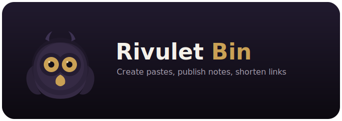

<p align="center">
  
</p>

Self-hosted pastebin and link shortener inspired by projects like dogbin and its forks.

## Features

- Create code pastes with syntax highlighting
- Render Markdown pages
- Turn a URL into a short link
- Edit published items with a private edit URL
- Run locally on SQLite or in Docker with Postgres

## Quick Install

The project publishes a ready-to-run Docker image to GHCR:

- `ghcr.io/taminum/rivulet-bin:latest`

Run it with Docker Compose:

```bash
docker compose up -d
```

Then open [http://localhost:15212](http://localhost:15212).

## Local run

```bash
python -m venv .venv
.venv\Scripts\activate
pip install -r requirements.txt
uvicorn app.main:app --reload --port 15212
```

Then open [http://localhost:15212](http://localhost:15212).

## Manual QA

There's no automated test suite yet, so a few behaviors worth checking by
hand after touching expiry logic:

- **Burn-after-read / expiry bypass via raw and PDF export** - create a
  paste with "Expires: after 1 view", open `/{slug}` once (this should
  consume the view and delete the paste), then confirm:
  - `/{slug}` again returns 410 Gone, not the content.
  - `/raw/{slug}` returns 404 ("Paste not found or expired"), not the raw
    text.
  - `/raw/{slug}/pdf` returns 404, not a downloadable PDF.

## Docker Compose

```bash
docker compose up -d
```

This uses the published image from GHCR.

## Build From Source

If you want to build the image locally from the checked out source:

```bash
docker compose -f docker-compose.yml -f docker-compose.dev.yml up --build -d
```

Then open [http://localhost:15212](http://localhost:15212).

## Docker Image Publishing

The repository includes a GitHub Actions workflow that builds and publishes a multi-arch image to GHCR on every push to `main` and on tags like `v1.0.0`.

## Branding

You can rebrand the service with environment variables:

- `SITE_NAME`
- `SITE_TAGLINE`
- `SECRET_SALT`
- `MAX_CONTENT_SIZE`
